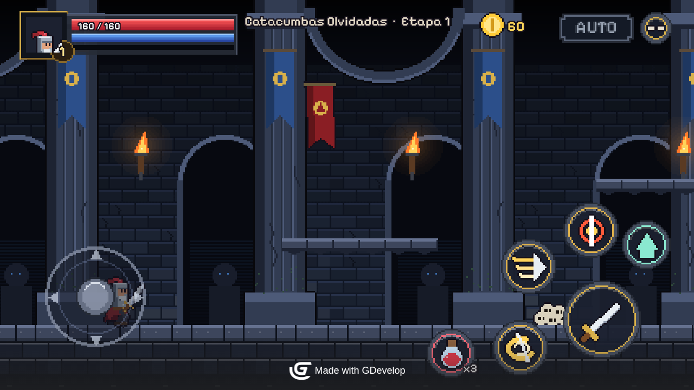

# Umbral de Ceniza

RPG de acción pixel-art 2D para Android hecho con **GDevelop 5**, en la línea de *Darkrise*: eliges clase,
bajas a mazmorras sala por sala, limpias oleadas, recoges botín por rareza, subes de nivel, vences al jefe y
vuelves al pueblo a mejorar tu equipo. Todo el arte, audio, textos y nombres son **originales**.



## Qué incluye

| | |
|---|---|
| Escenas | `Titulo` · `SeleccionClase` · `Pueblo` (hub) · `Mazmorra` (etapa jugable) |
| Clases | **Guerrero** (Torbellino, Embestida, Grito de guerra) · **Maga** (Nova de escarcha, Meteoro, Barrera arcana) · **Arquera** (Disparo triple, Lluvia de flechas, Paso sombrío) |
| Enemigos | Esqueleto, Murciélago de ceniza, Cultista, Bruto y el jefe **Caballero de Ceniza** (tajo, embestida, onda de choque, invocación, furia) |
| Progresión | 10 etapas en 2 capítulos (Catacumbas Olvidadas / Fortaleza Carmesí), EXP y niveles, botín Común → Legendario que se equipa o vende solo, Herrería (forja/refuerzo), Alquimista (pociones) |
| Móvil | Joystick + botones multitouch, enfriamientos visibles, pausa, **combate automático (AUTO)**, HUD anclado a los bordes (probado en 16:9 y 19.5:9), orientación horizontal |
| Guardado | Automático en el almacenamiento local de GDevelop (`UmbralSave`) |

## Abrir y jugar en GDevelop

1. Instala **GDevelop 5** (5.6 o superior): https://gdevelop.io/download
2. *Abrir proyecto* → `source/game.json`.
3. Pulsa **Vista previa** (▶). Empieza en la escena `Titulo`.

Toda la lógica son **eventos nativos** editables:
- `Pueblo` y `Mazmorra` enlazan los **eventos externos** compartidos `EV_Entrada` (stats y controles), `EV_Jugador`
  (movimiento, ataques, habilidades, poción), `EV_Combate` (daño, muerte, botín, nivel, guardado), `EV_HUD`.
- `EV_Enemigos` (sólo mazmorra): estadísticas por tipo/etapa e IA.
- Los objetos compartidos son **objetos globales** (carpetas Jugador, Enemigos, Botín, Nivel, HUD, Controles táctiles, Menús).
- Controles táctiles: extensión oficial *Multitouch joystick and buttons* (incluida en el proyecto).

### Controles

| Acción | Táctil | Teclado |
|---|---|---|
| Moverse / bajar de plataforma | joystick izquierdo | ← → / A D, ↓ / S |
| Saltar | botón ↑ | Espacio / W |
| Atacar (mantener) | botón grande | J |
| Habilidades 1 · 2 · 3 | botones de habilidad | K · L · I |
| Poción | botón rojo | H |
| Hablar / entrar | botón de diálogo (junto a NPC) | E |
| Combate automático | botón AUTO | T |
| Pausa | botón ‖ | Esc / P |
| Ficha del personaje (pueblo) | tocar el retrato | C |

## Android

El proyecto ya está configurado para Android (horizontal, `com.umbraldeceniza.juego`, iconos propios).

### APK de prueba (instalar en tu teléfono)

`tools/build_apk.mjs` genera `builds/UmbralDeCeniza-<versión>.apk` (≈4 MB, Android 7.0+) sin Android Studio: una
actividad a pantalla completa con un WebView que ejecuta el export HTML5 desde dentro del APK, sin usar la red.

1. Copia el APK al teléfono (o descárgalo desde donde te lo hayan enviado) y ábrelo.
2. Android pedirá permitir **instalar apps desconocidas** para la app con la que lo abriste (Archivos, Chrome…).
   Si Play Protect dice que no reconoce al desarrollador, elige **Instalar de todas formas**.
3. El juego va en horizontal y pantalla completa. Botón **Atrás** = pausa (o cerrar el menú abierto); dos veces
   seguidas = salir. La partida se guarda sola; se pierde si desinstalas la app.

Para generarlo (JDK 11+, Python 3 con Pillow y las build-tools de Android `aapt2`, `zipalign`, `apksigner`, `d8`/`dx`;
en Ubuntu/Debian: `sudo apt install aapt apksigner zipalign dalvik-exchange`):

```bash
cd tools
node export.mjs web
node build_apk.mjs          # builds/UmbralDeCeniza-1.0.0.apk, firmado con una clave de depuración
node test/apk_check.mjs     # arranca los archivos del APK en Chromium con el mismo origen que la app
```

Se firma con `~/.android/umbral-debug.p12` (se crea la primera vez) o con la clave de `APK_KEYSTORE`. Para
actualizar la app instalada sin desinstalarla hay que firmar con **la misma clave**. Es un APK para probar e
instalar a mano, no para Google Play.

### Export oficial de GDevelop (Google Play)

- **En GDevelop:** *Archivo → Exportar → Android* (compilación en la nube de GDevelop; requiere cuenta). Genera
  APK para probar o AAB para Google Play.
- **Compilación local con Cordova** (requiere Android SDK + JDK 17):
  ```bash
  cd tools && npm ci && node export.mjs cordova
  cd ../builds/android-cordova
  npx cordova@13.0.0 platform add android@14
  npx cordova@13.0.0 build android --debug
  ```
- **GitHub Actions:** `.github/workflows/android-apk.yml` compila un APK de depuración con Cordova en los runners de
  GitHub y lo deja en *Artifacts* del workflow.

> En el entorno donde se creó el proyecto el SDK de Android de Google no era descargable (`dl.google.com`
> bloqueado): el APK de prueba se hizo con las build-tools de Ubuntu y el `android.jar` de la API 34, y del camino
> Cordova se verificó hasta `cordova prepare`. Falta probar ambos en un teléfono real.

## Regenerar y probar (herramientas)

El proyecto se generó con un pipeline reproducible (ver `tools/README.md`):

```bash
cd source && python3 make_art.py && python3 make_audio.py   # arte y audio originales (Pillow)
cd ../tools && npm ci
node build_project.mjs      # genera y valida source/game.json con libGD 5.6.269
node export.mjs web         # builds/web (HTML5)
node test/run_tests.mjs     # 9 pruebas de gameplay en Chromium (Playwright) + capturas en evidence/
```

> ⚠️ `build_project.mjs` **sobrescribe** `source/game.json`. Si editas el juego en GDevelop, `game.json` pasa a ser la
> fuente de verdad: no vuelvas a ejecutar el generador sin trasladar antes tus cambios a `tools/scenes/`.

## Estado y evidencia

- Estado, decisiones y pendientes: `PROJECT_STATE.md` · gates: `GATE_STATUS.json`
- Informe de pruebas: `evidence/gameplay-tests/REPORT.md` · capturas reales: `evidence/screenshots/`
- Contratos: `GAME_SPEC.md`, `VISUAL_CONTRACT.md`, `ASSET_MANIFEST.json`
- Licencias: `source/LICENCIAS.md`
